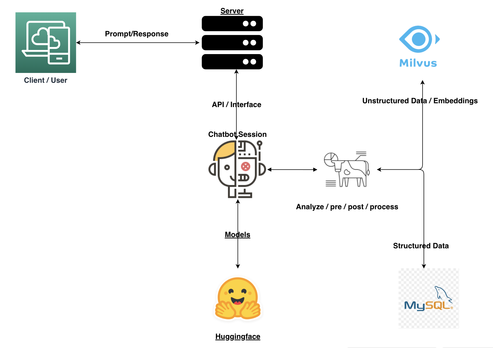

# Vector Database Implementation

## Abstract 
This application is a question-answering system that uses Milvus, MySQL, Gradio, and HuggingFace Sentence 
Transformers all-mpnet-base-v2 model to help people answer questions. 

## Vector Database Implementation

Vector databases are a powerful tool for analyzing unstructured data, allowing data to be stored in a format 
that makes it easier to access and manipulate. Vector databases provide various benefits over traditional 
methods of data structures such as relational databases. 

One benefit of vector databases is that they allow for more efficient analysis of unstructured data. Vector 
databases capture data in pre-defined representations which makes it easy to index elements that are useful 
for data analysis. Vector databases provide faster access to specific elements and business analytics 
applications can be built quickly over it. 

Another great advantage of vector databases is that they can quickly capture and analyze domain-specific 
knowledge. Domain-specific knowledge is the knowledge gathered from a specific field which helps to narrow 
down the search results for a given query.  Examples of domain-specific knowledge include legal knowledge 
for legal chatbot or search engines, medical knowledge for health chatbot or search engines or agricultural 
knowledge for agricultural chatbot or search engines.

Vector databases store data in vector form, meaning a set of numerical values organized into distinct 
vectors. In order to access a particular vector the database must first locate its position in the vector 
space then extract the data from that particular vector. This approach is helpful when used as a chatbot 
or a search engine, as the vector database can quickly pinpoint results that have the highest relevance 
to the specified query and provide the most correct answer.

## System Architecture

- The architecture of the system is designed to handle requests from client side and respond with the appropriate 
response. On the server side, requests are analyzed and the necessary information is retrieved from the 
Milvus and MySQL databases by going through both the structured and unstructured data. Once all the data 
is analyzed, the server constructs and sends the response back to the client. Security measures are also 
put in place on the server side to ensure the safety of the data stored in the databases. The client side 
then displays the response to the user. The chatbot system is capable of various features such as question 
and answering, searching, and more. Hummingface model repository is used to download the models and any needed datasets. 
This can also be done using a private repository such as github or gitlab, but for this project we used 
the public repository.

- Figure 1: System Architecture for chatbot API implementation

## Demo 

- Figure 2: Simple chatbot demo using Gradio

MAC Address: 24:5E:BE:13:EB:49
MAC Address: 24:5E:BE:13:EB:4A

